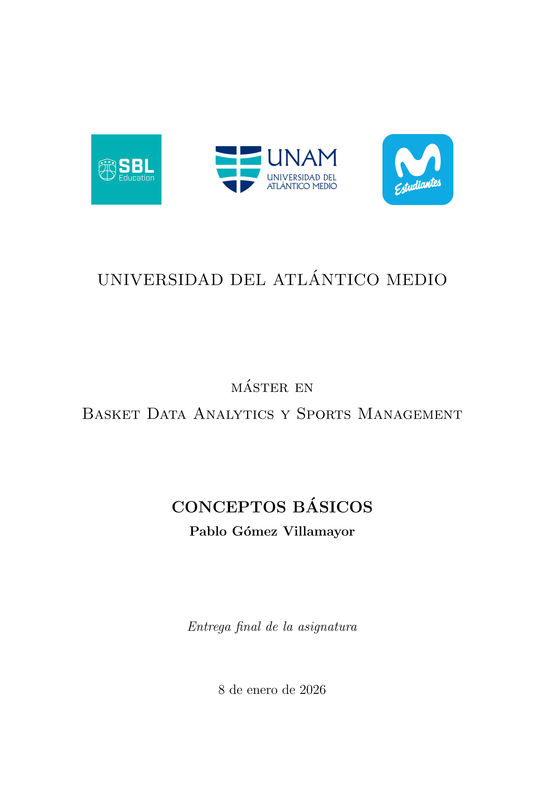

# MBDA: Máster en Basket Data Analytics & Sports Management (2025–2026)

##  BLOQUE COMÚN

## ASIGNATURA: "1. Conceptos Básicos"

---

### TFA: Análisis de un cuarto de un partido de Liga Endesa (Baxi Manresa - Hiopos Lleida. Jornada 7. Temporada 2025-2026)

• Construcción de un **Play By Play** manual, construido a partir del video del partido.

• Reconstrucción de la estadística convencional del partido (**boxscore**).

• Cálculo de métricas avanzadas: POSESIONES, OER, DER, eFG%, TS%, PPSA, USG%, etc.

• Creación de gráficos (dashboards) para presentar información relevante.

---

  

---

### Contenidos incluidos en la entrega:

• Análisis en Excel (.xlsx).

• Documento de texto: Informe-resumen (.pdf generado con \LaTeX).

---

### Contenidos incluidos en el repositorio: Dashboards variados

• Evolución del marcador (2D line graph)

• Puntos por jugador (2D bar graph)

• Ratio de tiros asistidos/no asistidos (Pie chart)

• Valoración vs Tiempo de juego (Scatter plot)

• USG% vs OER (Scatter plot. Rendimiento ofensivo)
