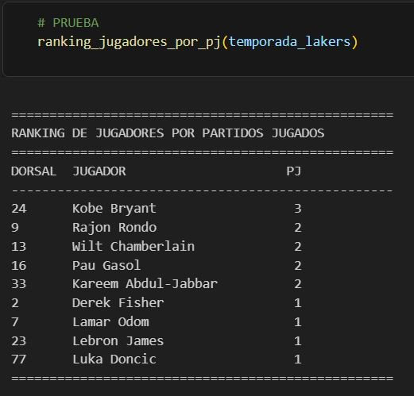

# MBDA: Máster en Basket Data Analytics & Sports Management (2025–2026)

##  BLOQUE COMÚN

## ASIGNATURA:  "2. Programación"

---

### TFA: Calculadora de métricas

Se construyó una calculadora que permite registrar las estadísticas de un equipo. 
La calculadora va escalando en complejidad, permitiendo incluir datos de un único jugador en un partido, 
de todo el equipo en un partido, y de todo el equipo en una temporada. 

A partir de estos datos, se reconstruye la estadística convencional (**boxscore**) y se realizan cálculos
de estadística avanzada, tanto a nivel individual como de equipo.

Se incluyeron funciones variadas, para introducir dorsales de jugadores válidos, fechas de partidos coherentes, validación de identidad de jugadores, etc.

---

  

---

### Contenidos incluidos en la entrega:

• Notebook con la calculadora (.ipynb).

---

### Contenidos incluidos en el repositorio: ejemplos de ejecucuión de la calculadora

Se construyeron equipos y partidos ficticios para probar el código. Se incluyen tres ejemplos:

• Ej_1: Partido -> Cálculos de estadística avanzada.

• Ej_2: Temporada -> Boxscore acumulado de todos los partidos de la temporada. 

• Ej_3: Temporada -> Ranking de jugadores por partidos jugados.
