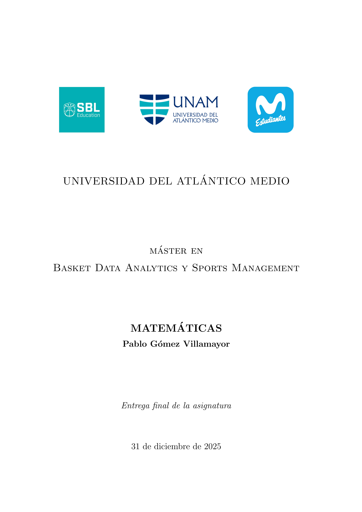

# MBDA: Máster en Basket Data Analytics & Sports Management (2025–2026)

##  BLOQUE COMÚN

## ASIGNATURA: "3. Matemáticas"

---

### TFA: Resolución de ejercicios diversos: estadística, probabilidad, álgebra Lineal & análisis matemático

---

  

---

### Contenidos incluidos en la entrega:

• Documento de texto (.pdf generado con \LaTeX).

---

### Contenidos incluidos en el repositorio:

• Representación gráfica de una función (generada con el paquete TikZ de \LaTeX).
