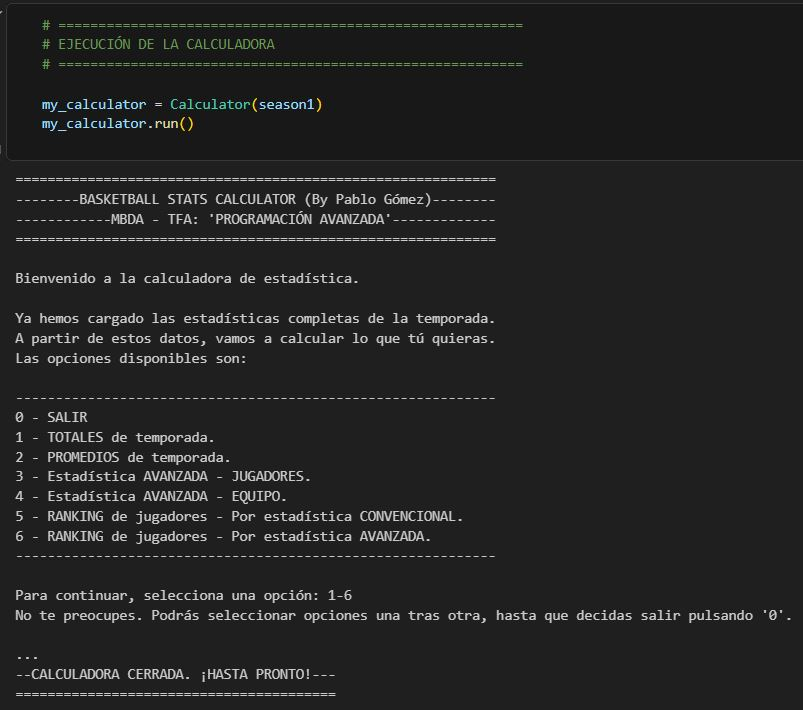

# MBDA: Máster en Basket Data Analytics & Sports Management (2025–2026)

##  BLOQUE COMÚN

## ASIGNATURA:  "5. Programación Avanzada"

---

### TFA: CALCULADORA DE MÉTRICAS - VERSIÓN MEJORADA

• Programación Orientada a Objetos (POO).

• Re-factorización del código de la calculadora anterior, incluyendo nuevos conceptos: Control de excepciones, logging, iteradores zip(), list comprehesions, etc.

• Nueva arquitectura: Estructura jerárquica. Clases 'Player', 'PlayerGameStats', 'TeamGameStats', 'MyTeamGame', 'OpponentTeamGame', 'Game' y 'Season'.

• Ejecución final: Estructura jerárquica. Clase 'Calculator'.

---

  

---

### Contenidos incluidos en la entrega:

• Notebook con la calculadora (.ipynb).

---

### Contenidos incluidos en el repositorio: ejemplos de ejecucuión de la calculadora

Se construyeron equipos y partidos ficticios para probar el código. Se incluyen doce ejemplos:

• Ej_1: Jerarquía de las clases.

• Ej_2: Boxscore de un partido.

• Ej_3: Clase 'PlayerGameStats'.

• Ej_4: Clase 'MyTeamGameStats'.

• Ej_5: Clase 'OpponentGameStats'.

• Ej_6: Información de un partido.

• Ej_7: Estadística avanzada - Jugadores.

• Ej_8: Estadística avanzada - Equipos.

• Ej_9: Temporada - Estadísticas totales.

• Ej_10: Temporada - Estadísticas avanzadas.

• Ej_11: Ranking jugadores - Estadística convencional: puntos.

• Ej_12: Ranking jugadores - Estadística avanzada: posesiones consumidas.

