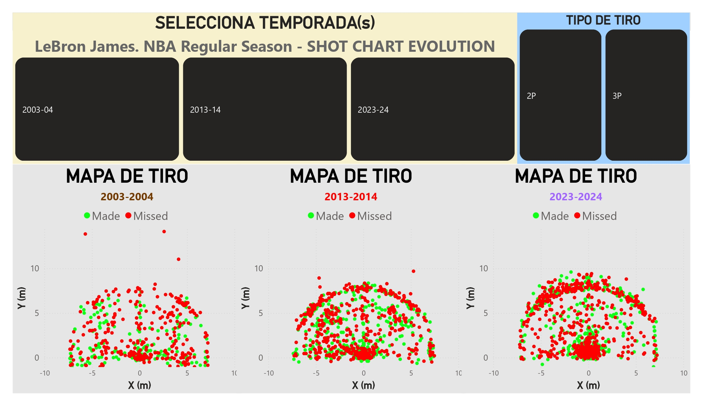
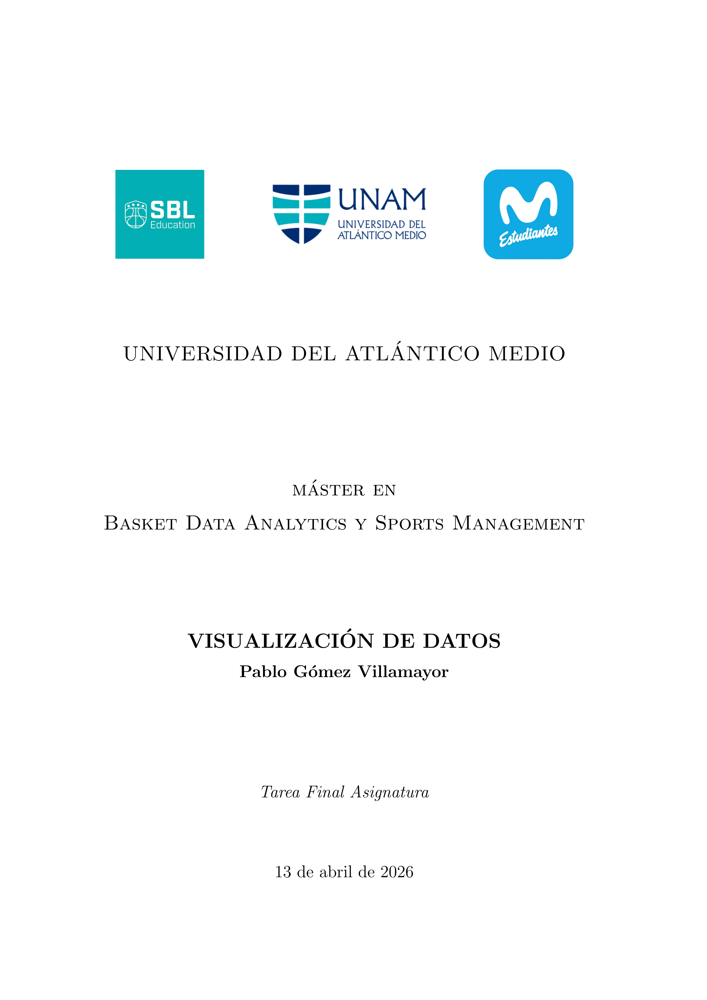
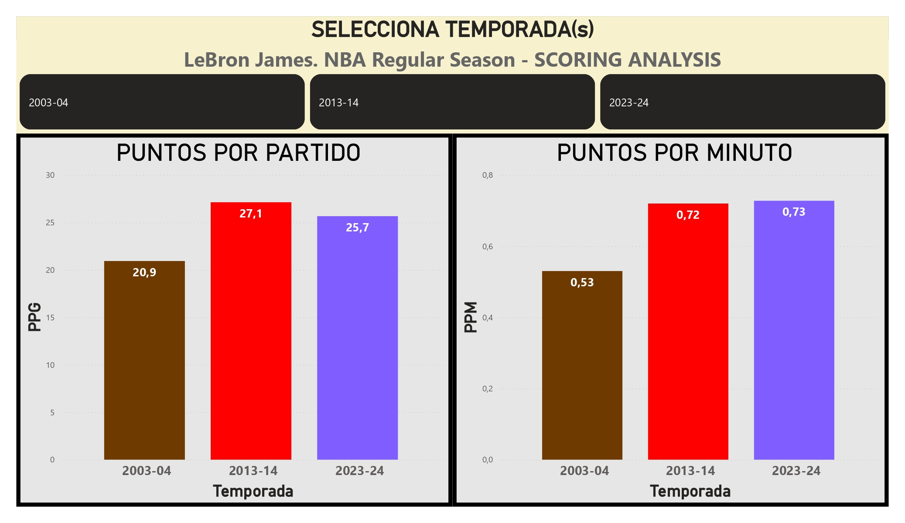
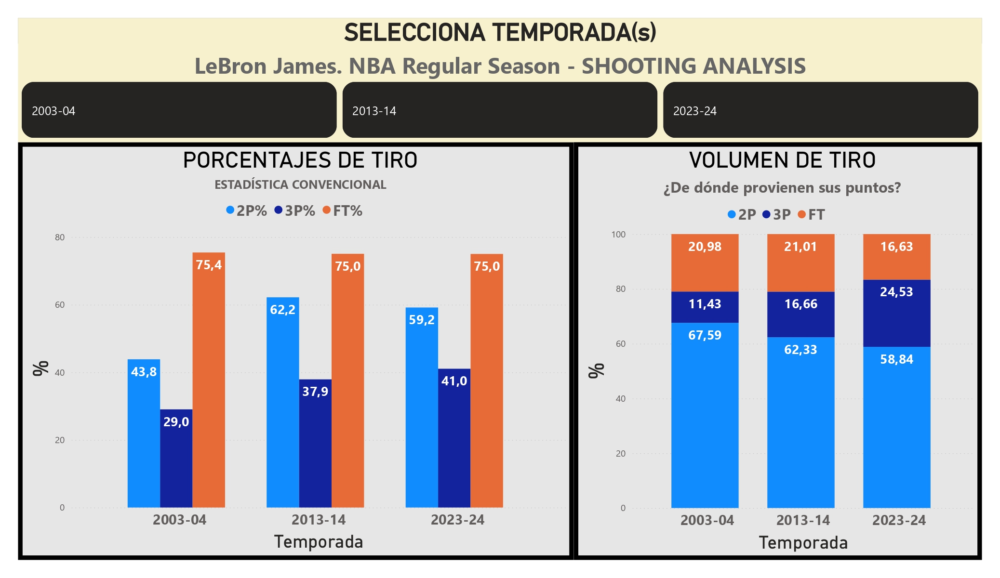
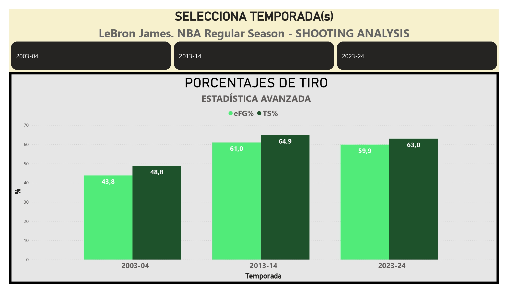
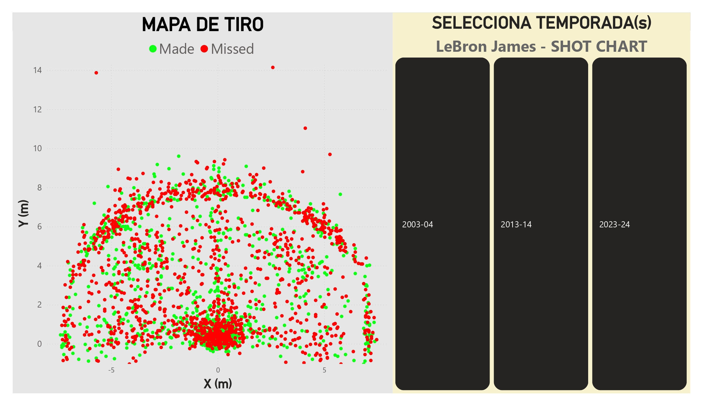

# MBDA: Máster en Basket Data Analytics & Sports Management (2025–2026)

##  BLOQUE COMÚN

## ASIGNATURA:  "6. Visualización de Datos"

• Power BI: Limpieza y transformación de datos, construcción de medidas DAX, construcción de paneles de visualización (**dashboards**).

---

### TFA: LeBron James. Análisis de su evolución como anotador: 2003 vs 2013 vs 2023.

A partir de datos de LeBron James de 20 temporadas (desde 2003-2004 hasta 2023-2024), se construyeron diversos paneles que permiten analizar su evolución como anotador,
adaptación a cambios físicos y al cambio del juego. Se utilizaron datos de todos los tiros intentados por LeBron en esas temporadas, así como datos de estadística convencional. Se construyeron un total de cinco paneles de visualización:

1. Anotación general.
2. Porcentajes de tiro convencionales.
3. Porcentajes de tiro avanzados.
4. Mapa de Tiro general (**Shot Chart**).
5. Mapa de Tiro comparativo.

  

---

  

---

### Contenidos incluidos en la entrega:

• Análisis en Power BI (.pbix).

• Informe de resultados obtenidos (.pdf generado con \LaTeX).

---

### Contenidos incluidos en el repositorio: dashboards completos.

---

### Comentarios adicionales:

• Dataset disponible gratuitamente en Kaggle: https://www.kaggle.com/datasets/eduvadillo/lebron-james-career-shots

---

  
  

  
  

