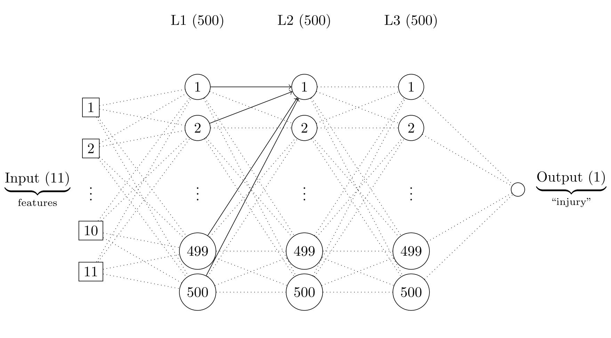

# MBDA: Máster en Basket Data Analytics & Sports Management (2025–2026)

## BLOQUE ESPECÍFICO: ANÁLISIS DE DATOS - ML

### Asignatura: Machine Learning I

---

  

---

### TFA: Predicción y Análisis de Lesiones en NBA:

---

### Objetivo: Implementación de modelos de aprendizaje automático.

### 🔹 Tarea 1: Clustering -> Agrupar lesiones similares.

• Modelos utilizados:
  - KMEANS.
  - Clustering jerárquico.

### 🔹 Tarea 2: Predicción de lesiones -> • Predecir el riesgo de lesión en base al rendimiento y carga de juego.

• Modelos utilizados:
  - Árboles de decisión (con sklearn) -> Mejora de desbalanceo de clases con SMOTE.
  - Redes neuronales (con Keras)  -> Ajuste de treshold para mejorar el rendimiento del modelo.

---

### Modelos guardados:

Se construyeron 3 modelos en total: 2 árboles de decisión y 1 red neuronal.

Todos están disponibles en este directorio del repositorio, en la subcarpeta "models".

• Árboles de decisión → `.pkl`.

• Red neuronal → `.keras`.

---

### Herramientas utilizadas:

• Python: Pandas · Scikit-learn · Keras.
• LaTeX: TikZ (generación de imagenes). Las imágenes están disponibles en la subcarpeta "images".

### Análisis completos:

Además de los modelos y las imágenes, hemos incluido en este repositorio los notebooks que incluyen la resolución completa de ambas tareas.

Estos archivos, tanto en formato `.ipynb` como `.html`, están disponibles en la subcarpeta "notebooks". 

¡Animamos al lector de estas líneas a que les eche un vistazo!

Gracias por visitar el repositorio.

Pablo.

