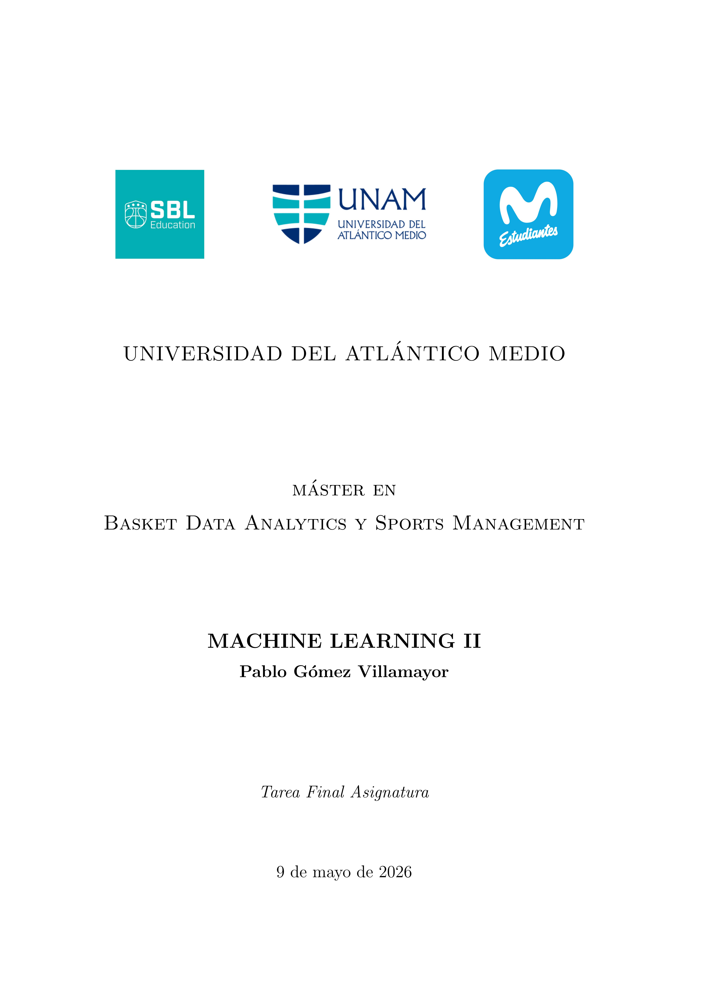
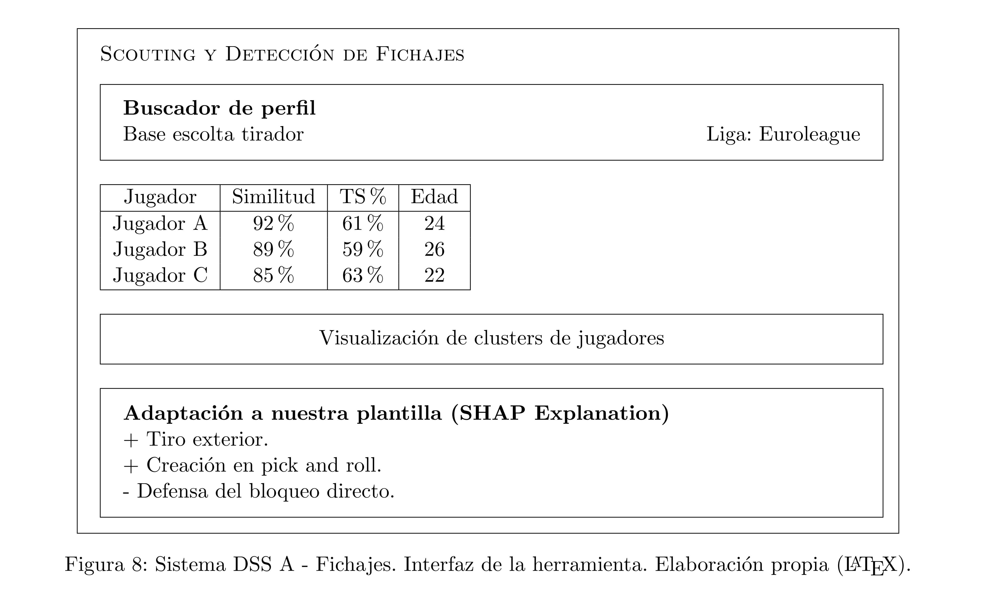
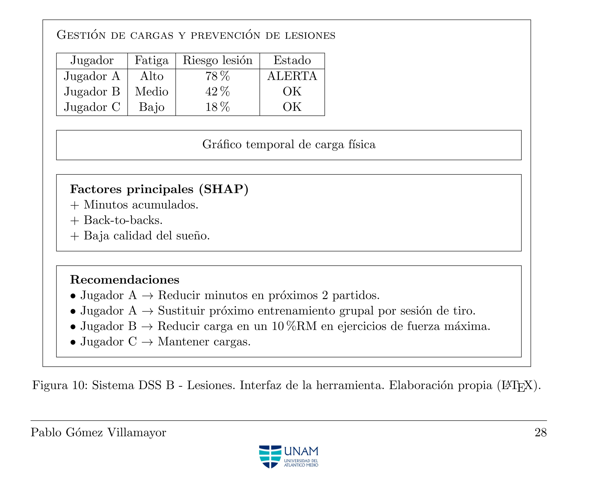

# MBDA: Máster en Basket Data Analytics & Sports Management (2025–2026)

## BLOQUE ESPECÍFICO: ANÁLISIS DE DATOS - ML

## ASIGNATURA: Machine Learning II

---

### TFA: Ejercicios variados sobre ML.

#### 🔹 Ejercicio 1: Preguntas de respuesta abierta sobre ML.
#### 🔹 Ejercicio 2: Modelo de predicción de victorias a partir de Boxscore.
#### 🔹 Ejercicio 3: Diseño de sistemas de ayuda a la toma de decisión (DSS).

---

  

---

### Contenidos incluidos en la entrega:

• Notebook con el modelo entrenado (.ipynb).

• Documento de texto con todas las respuestas a los ejercicios (.pdf generado con \LaTeX).

---

### Contenidos incluidos en el repositorio: dashboards completos.

• Esquemas de una red neuronal genérica y de la red neuronal entrenada (generadas con el paquete TikZ de \LaTeX).

  

  

• DSS - 1 - Fichajes (esquema generado con \LaTeX).

  

• DSS - 2 - Prevención de lesiones (esquema generado con \LaTeX).

  

---

### Herramientas utilizadas:

• **Python**: Pandas · Scikit-learn · Keras · SHAP.

• **LaTeX**: TikZ (paquete para generación de imágenes).
