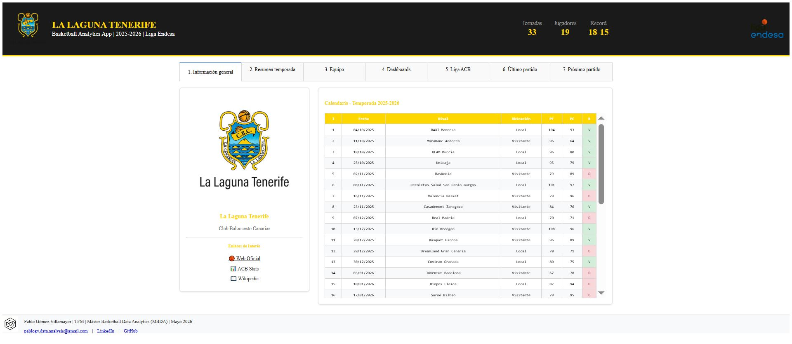
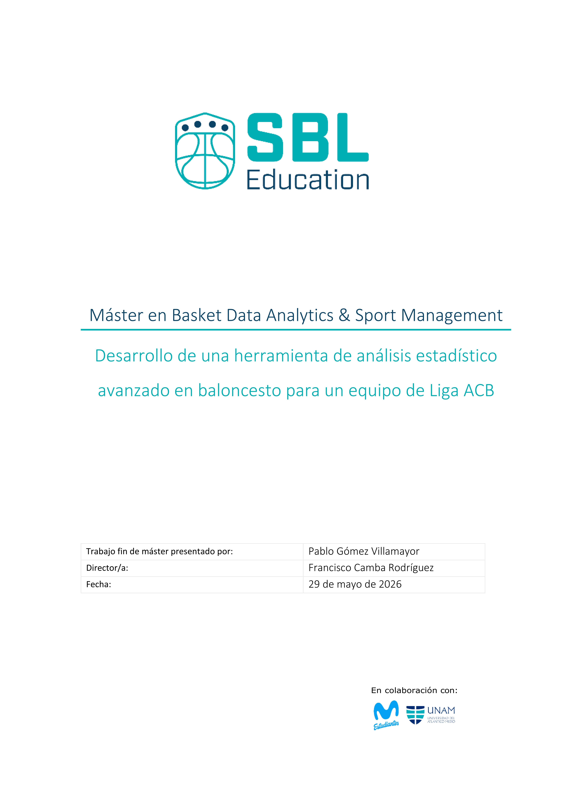

# MBDA: Máster en Basketb Data Analytics & Sports Management (2025–2026)

## Trabajo Fin de Máster (TFM)

## Desarrollo de una herramienta de análisis estadístico avanzado en baloncesto para un equipo de Liga ACB

---

## Vista previa de la herramienta

  

---

## Descripción del proyecto

El presente Trabajo Fin de Máster desarrolla una herramienta web de análisis estadístico aplicada al baloncesto profesional, diseñada específicamente para el contexto competitivo de un equipo de Liga Endesa ACB. En particular, hemos escogido a *La Laguna Tenerife* (LLT).

La aplicación integra estadística convencional, métricas avanzadas y visualizaciones interactivas orientadas al análisis del rendimiento colectivo e individual, así como a la preparación táctica de partidos y procesos de scouting.

El objetivo principal del proyecto consiste en facilitar la interpretación y explotación práctica de grandes volúmenes de información estadística dentro de un entorno profesional de baloncesto.

---

## Acceso a la aplicación

### Plataforma Railway
🔗 https://tfmlltapppablogv-production.up.railway.app/

### Plataforma Render
🔗 https://tfm-llt-app-pablogv.onrender.com/

---

## Funcionalidades principales

La herramienta incluye:

- Visualización interactiva de estadísticas de temporada.
- Dashboards avanzados de rendimiento individual y colectivo.
- Estadística avanzada de jugadores y equipos.
- Rankings percentiles y métricas normalizadas.
- Análisis post-partido.
- Preparación pre-partido y scouting del rival.
- Comparativas contextuales respecto al promedio de la liga.

---

## Aplicación práctica en entorno profesional

La plataforma ha sido concebida como una herramienta de apoyo para:

- Staff técnico.
- Entrenadores asistentes.
- Departamentos de análisis de datos.
- Procesos de scouting y preparación táctica.

La información presentada permite estructurar procesos de análisis posteriores al partido y preparación estratégica previa, facilitando la generación de informes resumidos y adaptados a las necesidades del cuerpo técnico y de los jugadores.

---

## Tecnologías utilizadas

### Desarrollo de la aplicación
- **Python**
- **Dash**
- **Plotly**
- **Git / GitHub**

### Procesamiento y análisis de datos
- **Pandas**
- **NumPy**

---

## Contenidos incluidos en la entrega

• Herramienta: Aplicación web interactiva.

• Documento de texto del TFM ('.pdf' generado con Word).

---

### Contenidos incluidos en el repositorio: todas las imágenes que aparecen en el texto del TFM.

- Aplicación web interactiva.
- Documento final del TFM en formato PDF.

---

## Portada del documento

  

